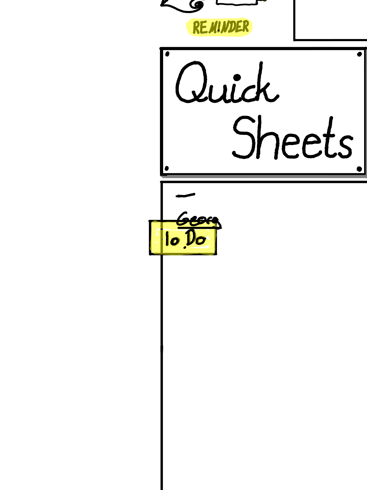
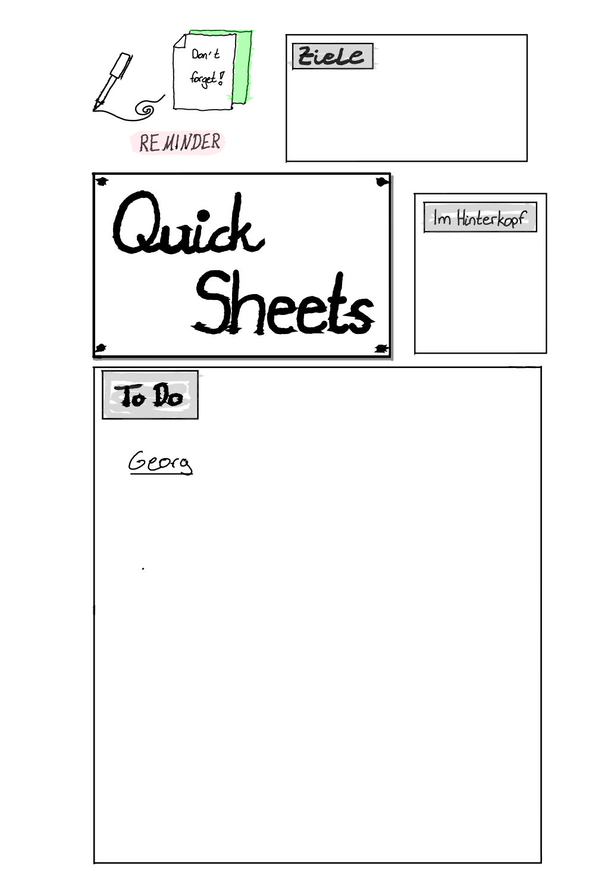
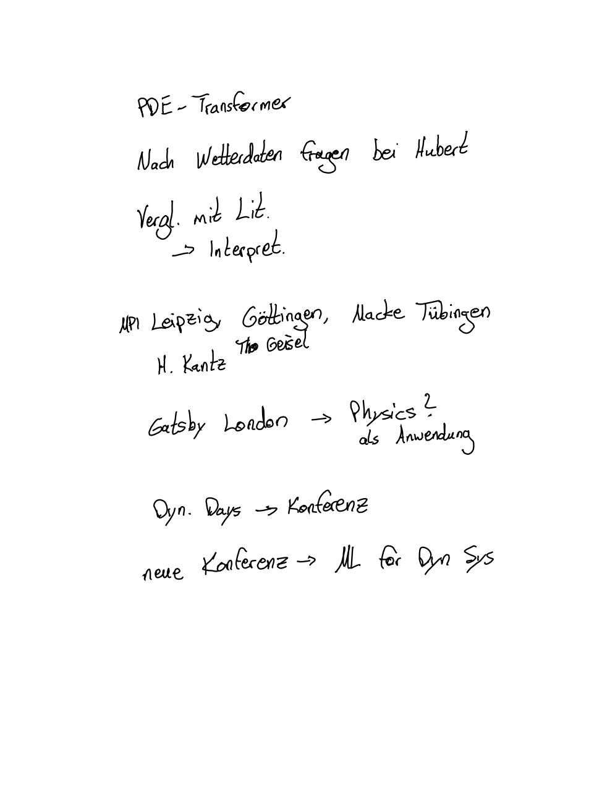

# V6 Format Test Output

This directory contains visual evidence that the V6 format parser is working correctly.

## How to Reproduce

### 1. Render with Go (our implementation)

```bash
# From the repository root directory
cd /path/to/rmapi

# Extract the .rm files from the rmdoc archive
mkdir -p /tmp/extract_quick
unzip -o "Quick sheets.rmdoc" -d /tmp/extract_quick

# Find the .rm files
find /tmp/extract_quick -name "*.rm"

# Render a specific page to SVG
go run test_output/render_v6_svg.go \
    /tmp/extract_quick/*/eb6f9de9-ae41-47a1-849d-20d9b426a5e7.rm \
    test_output/quick_sheets_page1.svg

# Convert SVG to PNG (requires cairosvg: pip install cairosvg)
cairosvg test_output/quick_sheets_page1.svg -o test_output/quick_sheets_page1_go.png
```

### 2. Render with Python (reference implementation)

```bash
# Install dependencies
pip install rmscene rmc cairosvg Pillow

# Run the reference Python script
python3 rm2png.py "Quick sheets.rmdoc" -o test_output/python_output
```

## Test Results

### Page 1: Quick Sheets Title Page

| Go Implementation | Python Reference (rmscene) |
|-------------------|---------------------------|
|  |  |

**Go parser results:**
- Version: 2 (V6 format)
- Lines parsed: 148
- Correctly renders: "REMINDER" (highlighted), "Quick Sheets", "Georg", "To Do" (highlighted), frame boxes

**Note:** The Python version shows additional typed text elements ("Ziele", "Im Hinterkopf", "Don't forget!") because the rmscene library also extracts Text blocks. Our Go implementation currently only extracts stroke/line data, which is sufficient for handwritten content rendering.

### Page 2: Notes Page

| Go Implementation | Python Reference (rmscene) |
|-------------------|---------------------------|
|  |  |

**Go parser results:**
- Version: 2 (V6 format)  
- Lines parsed: 235
- Correctly renders all handwritten notes

## Files in this Directory

- `render_v6_svg.go` - Go tool to render V6 .rm files to SVG
- `quick_sheets_page1.svg` - SVG output from Go
- `quick_sheets_page1_go.png` - PNG from Go output
- `quick_sheets_page1_python.png` - PNG from Python rmscene reference
- `quick_sheets_page2.svg` - SVG output from Go (page 2)
- `quick_sheets_page2_go.png` - PNG from Go output (page 2)
- `quick_sheets_page2_python.png` - PNG from Python reference (page 2)

## Verification

The Go implementation correctly parses and renders:
1. ✅ Block structure with correct length handling
2. ✅ Line/stroke data extraction
3. ✅ Point coordinates (X, Y)
4. ✅ Brush types (Fineliner, Marker, Highlighter, etc.)
5. ✅ Brush colors (Black, Grey, Yellow for highlights)
6. ✅ Brush sizes
